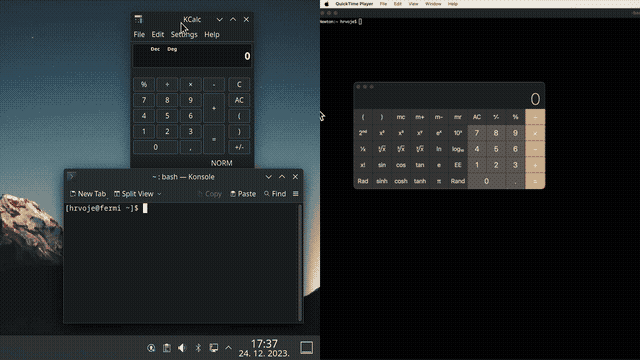
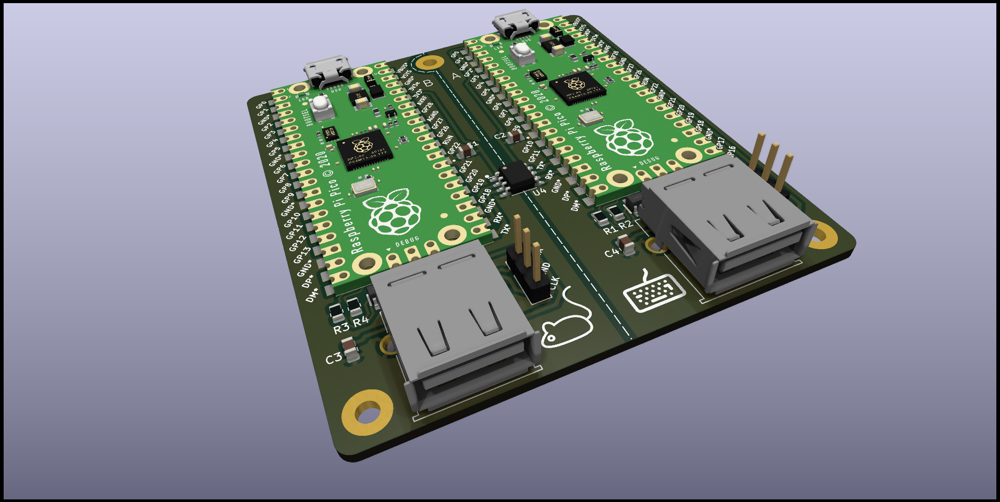
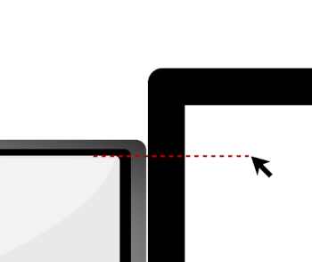
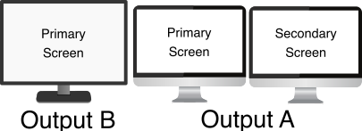
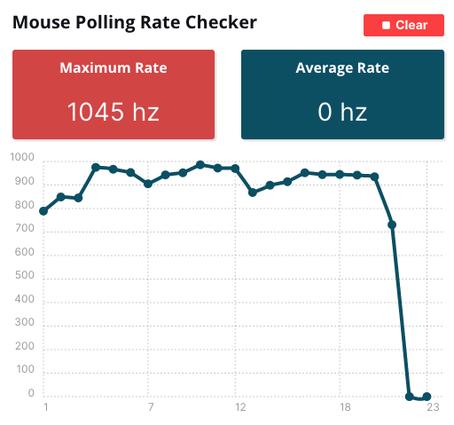

#  DeskHop - Fast Desktop Switching

Did you ever notice how, in the crazy world of tech, there's always that one quirky little project trying to solve a problem so niche that its only competitors might be a left-handed screwdriver and a self-hiding alarm clock?

I use two different computers in my daily workflow and share a single keyboard/mouse pair between them. Trying several USB switching boxes found on Amazon made me realize they all suffer from similar issues - it takes a while to switch, the process is quite clumsy when trying to find the button and frankly, it just doesn't get any better with time. 

All I wanted was a way to use a keyboard shortcut to quickly switch outputs, paired with the ability to do the same by magically moving the mouse pointer between monitors. This project enables you to do both, even if your computers run different operating systems!


## Features

- Completely **free and open source**
- No noticeable delay when switching
- Simply drag the mouse pointer between computers
- No software installed
- Affordable and obtainable components (<15€)
- 3D printable snap-fit case
- Full Galvanic isolation between your outputs
- Works with Linux, macOS and Windows

------

## How it works

The device acts as an intermediary between your keyboard/mouse and the computer, establishing and maintaining connections with both computers at once. Then it chooses where to forward your mouse and keystrokes to, depending on your selection. Keyboard follows the mouse and vice versa, so just dragging the mouse to the other desktop will switch both.

## Mouse 

To get the mouse cursor to magically jump across, the mouse hid report descriptor was changed to use absolute coordinates and then the mouse reports (that still come in relative movements) accumulate internally, keeping the accurate tally on the position. 

When you try to leave the monitor area in the direction of the other monitor, it keeps the Y coordinate and swaps the maximum X for a minimum X, then flips the outputs. This ensures that the cursor seamlessly appears at the same height on the other monitor, enhancing the perception of a smooth transition.



 <p align="center"> Dragging the mouse from Mac to Linux automatically switches outputs. 
 </p>

-----
 
The actual switch happens at the very moment when one arrow stops moving and the other one starts.

## Keyboard

Acting as a USB Host and querying your keyboard periodically, it looks for a preconfigured hotkey in the hid report (usually Caps Lock for me). When found, it will forward all subsequent characters to the other output.

To have a visual indication which output you are using at any given moment, you can repurpose keyboard LEDs and have them provide the necessary feedback. 

It also remembers the LED state for each computer, so you can pick up exactly how you left it. 


## How to build

To avoid version mismatch and reported path issues when building, the project now bundles minimal pico sdk and tinyusb.

You should be able to build by running:

```
cmake -S . -B build
cmake --build build
```

## Using pre-built images

Alternatively, you can use the [pre-built images](binaries/). Take the Pico board that goes to slot A on the PCB and hold the on-board button while connecting the cable.

It should appear as a USB drive on your system. Copy the corresponding board_A.uf2 file there and repeat the same with B.

## Upgrading firmware

Option 1 - Open the case, hold the button while connecting each Pico and copy the right uf2 to it.

Option 2 - Switch a board to BOOTSEL mode by using a special key combination (listed below). 

This will make the corresponding Pico board enter the bootloader upgrade mode and act as USB flash drive. Now you can drag-and-drop the .uf2 file to it (you might need to plug in your mouse directly).

## Misc features

### Mouse slowdown

Ever tried to move that YT video slider to a specific position but your mouse moves too jumpy and suddenly you are moving your hand super-carefully like you're 5 and playing "Operation" all over again?

**Press right CTRL + right ALT** to toggle a slow-mouse mode. The mouse pointer will slow down considerably, enabling you to get the finer precision work done and still have your mouse moving normally by quickly pressing the same keys again.

### Switch Lock

If you want to lock yourself to one screen, use ```RIGHT CTRL + L```.
This will make sure you won't accidentally leave your current screen. To turn off, press the same key combo again.

### Screensaver

Supposedly built in to prevent computer from entering standby, but truth be told - it is just fun to watch. **Off by default**, will make your mouse pointer bounce around the screen like a Pong ball. When enabled, it activates after a period of inactivity defined in user config header and automatically switches off as soon as you send any output towards that screen. 

Potential usage example - I have a buggy USB dock that won't resume video from standby, so not allowing it to sleep can be a handy workaround. 


## Hardware

[The circuit](schematics/DeskHop_v1.1.pdf) is based on two Raspberry Pi Pico boards, chosen because they are cheap (4.10 € / pc), can be hand soldered and most suppliers have them in stock.

The Picos are connected using UART and separated by an Analog Devices ADuM1201 dual-channel digital isolator (~3€) or a much cheaper, faster and pin-compatible TI ISO7721DR (~1.5€). 

While they normally don't have support for dual USB, thanks to an [amazing project](https://github.com/sekigon-gonnoc/Pico-PIO-USB) where USB is implemented using the programmable IO wizardry found in RP2040, there is support for it to act both as an USB host and device.  

## PCB [updated]

To keep things as simple as possible for DIY builds, the traces were kept on one side and the number of parts kept to a theoretical minimum.



USB D+/D- differential lines should be identical in length, but they are slightly asymmetrical on purpose to counter the length difference on the corresponding GPIO traces PICO PCB itself, so the overall lengths should match.

Zd (differential impedance) is aimed as 90 ohm (managed to get ~107, close enough :)).

The thickness is designed to be 1.6 mm for snap-fit to work as expected.

There are 2 versions of the PCB (no major differences for the user). Original (v1.0) is easier to solder and assemble, while v1.1 offers some upgrades like:
 - added ESD protection (TPD4E1U06DBVR)
 - added VBUS capacitor for the keyboard/mouse connectors
 - silkscreen orientation markings
 - holes for clone boards with headers pre-soldered and easier alignment
 - USB 27 ohm resistors
 
  This version is slightly more difficult to hand solder due to the small transient voltage suppressor IC and 0805 resistors, but it's totally doable. TVS can in theory be omitted (not advised) and it will still work.

Upcoming - board with bare rp2040s that doesn't need Picos, is smaller and more convenient.

## Case

Since I'm not very good with 3d, the case is [simple and basic](case/) but does the job. It should be easy to print, uses ~33g of filament and takes a couple of hours.

Horizontal PCB movements are countered by pegs sliding through holes and vertical movements by snap-fit lugs on the sides - no screws required. The case was given a slight redesign to feature the logo and two additional snap-fit lugs, so it provides a better seal.

Micro USB connectors on both boards are offset from the side of the case, so slightly larger holes should allow for cables to reach in. 

The lid is of a snap-fit design, with a screwdriver slot for opening. The markings on top are recessed and can be finished with e.g. crayons to give better contrast (or simply left as-is).


## Bill of materials 

<details closed>
  <summary>Click here to view original PCB v1.0 BOM</summary>

| Component          | Qty | Unit Price / € | Price / €|
|--------------------|-----|----------------|----------|
| Raspberry Pi Pico  | 2   | 4.10           | 8.20     |
| ADuM1201BRZ        | 1   | 2.59           | 2.59     |
| Cap 1206 SMD 100nF | 2   | 0.09           | 0.18     |
| USB-A PCB conn.    | 2   | 0.20           | 0.40     |
| Headers 2.54 1x03  | 2   | 0.08           | 0.16     |
|                    |     |                |          |
|                    |     |          Total | 11.53    |

TI ISO7721DR can be used instead of the ADuM - it's pin-compatible, much cheaper and with better specs.

</details>

#### PCB v1.1

| Component      | Part                | Qty | Unit Price / € | Price / €|
|----------------|---------------------|-----|----------------|----------|
|     U1, U2     | Raspberry Pi Pico   | 2   | 4.10           | 8.20     |
|     J1, J4     | USB-A PCB conn.     | 2   | 0.20           | 0.40     |
|       U4       | TI ISO7721DR        | 1   | 1.40           | 1.40     |
|                | (**OR** ADuM1201BRZ)|     |                |          |
|     C1, C2     | Cap 0805 SMD 100nF  | 2   | 0.09           | 0.18     |
| R1, R2, R3, R4 | Res 0805 SMD 27ohm  | 4   | 0.03           | 0.12     |
|     U3, U5     | TPD4E1U06DBVR       | 2   | 0.31           | 0.62     |
|     C3, C4     | Cap 4.7uF SMD 0805  | 2   | 0.07           | 0.14     |
|     J2, J3     | Headers 2.54 1x03   | 2   | 0.08           | 0.16     |
|                |                     |     |                |          |
|                |                     |     |          Total | 11.22    |

USB-A connector can be Molex MX-67643-0910 or a cheaper/budget one that shares the same dimensions.

Additional steps:

 - making the PCB ([Gerber provided](pcb/), choose 1.6 mm thickness)
 - 3d printing the case ([stl files provided](case/), ~33g filament)

## Assembly guide

If you have some experience with electronics, you don't need this. However, some of you might not, and in that case this video might help guide you through the process. Please note, after soldering you should clean the flux from the PCB to prevent corrosion. 

The standard process to do that is using isopropyl alcohol and an old toothbrush. But guess what? I'm not putting my old toothbrush online, so you'll just have to improvise that part :)

[](https://www.youtube.com/watch?v=LxI9NYi_oOU)

[NOTE] The video assembly guide covers pcb v1.0. The revised version is very similar and the procedure is basically the same. 

## Usage guide

### Keyboard shortcuts

_Firmware upgrade_
- ```Right Shift + F12 + Left Shift + A``` - put board A in FW upgrade mode
- ```Right Shift + F12 + Left Shift + B``` - put board B in FW upgrade mode

_Usage_
- ```Right CTRL + Right ALT``` - Toggle slower mouse mode
- ```Right CTRL + L``` - Lock/Unlock mouse desktop switching
- ```Right ALT + Right Shift + L``` - Lock both outputs at once (set output OS before, see shortcuts below)
- ```Caps Lock``` - Switch between outputs

_Config_
- ```Right Shift + F12 + D``` - remove flash config
- ```Right Shift + F12 + Y``` - save screen switch offset
- ```Right Shift + F12 + S``` - turn on/off screensaver option

_Number of outputs_
- ```Right Shift + Backspace + 1``` - set number of screens to 1 on current active output
- ```Right Shift + Backspace + 2``` - set number of screens to 2 on current active output

_Set operating systems_
- ```Right Shift + Backspace + 7``` - set os to Linux on current active output
- ```Right Shift + Backspace + 8``` - set os to Windows on current active output
- ```Right Shift + Backspace + 9``` - set os to MacOS on current active output

### Switch cursor height calibration

This step is not required, but it can be handy if your screens are not perfectly aligned or differ in size. The objective is to have the mouse pointer come out at exactly the same height.



Just park your mouse on the LARGER screen at the height of the smaller/lower screen (illustrated) and press ```Right Shift + F12 + Y```. Your LED (and caps lock) should flash in confirmation.

Repeat for the bottom border (if it's above the larger screen's border). This will get saved to flash and it should keep this calibration value from now on.


### Multiple screens per output

Windows and Mac have issues with multiple screens and absolute positioning, so workarounds are needed (still experimental). Your main screens need to be in the middle, and secondary screen(s) on the edges. Move the mouse to the screen with multiple desktops and press *right shift + backspace + 2* if you have 2 desktops and *right shift + backspace + 7, 8 or 9* depending on your OS (Linux, Windows, Mac).



### Other configuration

Mouse speed can now be configured per output screen and per axis. If you have multiple displays under Linux, your X speed might be too fast, so you need to configure it in user_config.h and rebuild. In the future, this will be configurable without having to do that.

### Functional verification

When you connect a new USB peripheral, the board will flash the led twice, and instruct the other board to do the same. This way you can test if USB and outgoing communication works for each board.

Do this test by first plugging the keyboard on one side and then on the other. If everything is OK, leds will flash quickly back and forth in both cases.

## Security and Safety

Some features are missing on purpose, despite the fact it would make the device easier to use or simpler to configure. Here is a quick breakdown of these decisions:

- There is no copy-paste or *any* information sharing between systems. This prevents information leakage.
- No webhid device management or any inbound connectivity from the output computers, with the only exception of standard keyboard LED on/off messages, hard limited to 1 byte of data.
- No FW upgrade triggering from the outputs. Only explicit and deliberate user action through a special keyboard shortcut may do that.
- No plugged-in keyboard/mouse custom endpoints are exposed or information forwarded towards these devices. Their potential vulnerabilities are effectively firewalled from the computer.
- No input history is allowed to be retained.
- Outputs are physically separated and galvanically isolated with a minimal isolation voltage of 2kV.
- All packets exchanged between devices are of fixed length, no code is transferred and no raw config exchange of any kind can take place.
- There is no bluetooth or wifi, networking, Internet access, usb drives etc.
- No connected computer is considered trusted under any circumstances.
- Entirety of the code is open source, without any binary blobs and thoroughly commented to explain its purpose. I encourage you to never trust anyone and always make sure you know what you are running by doing a manual audit.

This still doesn't guarantee anything, but I believe it makes a reasonable set of ground rules to keep you safe and protected.

## FAQ

1. I just have two Picos, can I do without a PCB and isolator?

*Sure. Having an isolator is recommended but it should work without it.*

2. What happens if I have two different resolutions on my monitors?

*The mouse movement is done in abstract coordinate space and your computer figures out how that corresponds with the physical screen, so it should just work.*

3. Where can I buy it?

*I'm not selling anything, this is just a personal, non-commercial hobby project.*

[UPDATE] It seems you can order it in QTY of 1 (for either PCB, assembled PCB or a fully assembled device) from [Elecrow if you follow this link](https://www.elecrow.com/deskhop-fast-desktop-switching.html)

*I **don't want to take any commission** on this - the only goal is to provide an alternative for people who don't feel confident enough to assemble the boards themselves.*

4. When the active screen is changed via the mouse, does the keyboard follow (and vice versa)?

*Yes, the idea was to make it behave like it was one single computer.*

5. Will this work with keyboard/mouse combo dongles, like the Logitech Unifying receiver?

*Not tested yet, but the latest version might actually work (please provide feedback).*

6. Will this work with wireless mice and keyboards that have separate wireless receivers (one for the mouse, another for the keyboard)?

*It should work - tried an Anker wireless mouse with a separate receiver and that worked just fine.*

7. I have issues with build or compilation

*Check out the [Troubleshooting Wiki](https://github.com/hrvach/deskhop/wiki/Troubleshooting) that might have some answers.*

## Software Alternatives

There are several software alternatives you can use if that works in your particular situation.

1. [Barrier](https://github.com/debauchee/barrier) - Free, Open Source
2. [Input Leap](https://github.com/input-leap/input-leap) - Free, Open Source
3. [Synergy](https://symless.com/synergy) - Commercial
4. [Mouse Without Borders](https://www.microsoft.com/en-us/garage/wall-of-fame/mouse-without-borders/) - Free, Windows only
5. [Universal Control](https://support.apple.com/en-my/HT212757) - Free, Apple thing

## Shortcomings

- Windows 10 broke HID absolute coordinates behavior in KB5003637, so you can't use more than 1 screen on Windows (mouse will stay on the main screen). There is an experimental workaround.
- Code needs cleanup, some refactoring etc.
- Not tested with a wide variety of devices, I don't know how it will work with your hardware. There is a reasonable chance things might not work out-of-the-box. 
- Advanced keyboards (with knobs, extra buttons or sliders) will probably face issues where this additional hardware doesn't work.
- Super-modern mice with 300 buttons might see some buttons not work as expected.
- NOTE: Both computers need to be connected and provide power to the USB for this to work (as each board gets powered by the computer it plugs into). Many desktops and laptops will provide power even when shut down nowadays. If you need to run with one board fully disconnected, you should be able to use a USB hub to plug both keyboard and mouse to a single port.
- MacOS has issues with more than one screens, latest firmware offers an experimental workaround that fixes it.

## Progress

So, what's the deal with all the enthusiasm? I can't believe it - please allow me to thank you all! I've never expected this kind of interest in a simple personal project, so the initial features are pretty basic (just like my cooking skills) and mostly cover my own usecase. Stay tuned for firmware updates that should bring wider device compatibility, more features and less bugs. As this is a hobby project, I appreciate your understanding for being time-constrained and promise to do the best I can.

Planned features:
- ~~Proper TinyUSB host integration~~ (done)
- ~~HID report protocol parsing, not just boot protocol~~ (mostly done)
- ~~Support for unified dongle receivers~~
- ~~Support for USB hubs and single-sided operation~~
- ~~Configurable screens (done)~~ 
- ~~Permament configuration stored in flash~~
- Better support for keyboards with knobs and mice with mickeys
- Unified firmware for both Picos
- ... and more!

Working on a *lite* version which provides basic functionality with just a single Pico W board, lowering the cost even further and enabling you to try it out even with no added hardware or PCB.

Mouse polling should now work at 1000 Hz (the dips in the graph is my arm hurting from all the movement :-)):



## Sponsor / donate

I'm NOT doing this for profit or any other reason except to try and help people by creating a better working environment for everyone.
I have, however, decided to accept donations for a single purpose only - to buy some keyboards/mice with media keys, buttons, nkro and other weird stuff people reported issues with in order to fix bugs, improve the state of the project and provide a better user experience overall.

Having said that, if you want to support the project, you can use this link:

[](https://www.paypal.com/donate/?hosted_button_id=4RDC7JY5FNC78)

Thank you!

## Disclaimer

I kindly request that anyone attempting to build this project understands and acknowledges that I am not liable for any injuries, damages, or other consequences. Your safety is important, and I encourage you to approach this project carefully, taking necessary precautions and assuming personal responsibility for your well-being throughout the process. Please don't get electrocuted, burned, stressed or angry. Have fun and enjoy! 

Happy switchin'!
